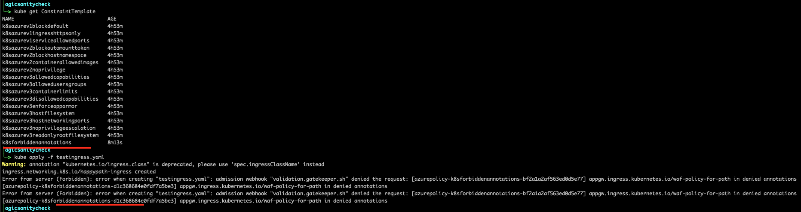

# Overview 
This policy performs the following 
 * Denys the creation of ingress object if the come with a specific set of annotation. the annotations are configurable. For example. this is taken from the azure policy defintions  
   * ``          "defaultValue": [
            "appgw.ingress.kubernetes.io/waf-policy-for-path",
            "forbiddenexample"
          ]`` 
 * its applied the Ingress objects. 
 * its applied to ingress objects with either of the following configs   
   * ingressClassName == "azure-application-gateway"
   * Annotation: "kubernetes.io/ingress.class":"azure/application-gateway 
   * any ingress without out these settings are ignored
## install GK 
Note: Testing on the OSS version of GK is the most efficent way of developing policy definitions. If deploying on Azure with Azure policy. Azure policy will autom generate the Constraint definition. in the OSS version we define it. 
```
helm repo add gatekeeper https://open-policy-agent.github.io/gatekeeper/charts
helm install gatekeeper/gatekeeper --name-template=gatekeeper --namespace gatekeeper-system --create-namespace 
```
### To test on OSS GK 

* deploy the [ Constraint template ](forbiddenannotation.yaml)
* deploy the Constraint  [definition](Constraint.yaml)
* deploy the 3 ingress tests [text](testingress.yaml)


## Deploy to Azure policy
 * go to any policy definition in Azure, and duplicate
 * replace contents in editior with [contents of azurepolicy](azurepolicy/azurepolicy.json)
 * Apply the policy to a k8s scope

## Result


